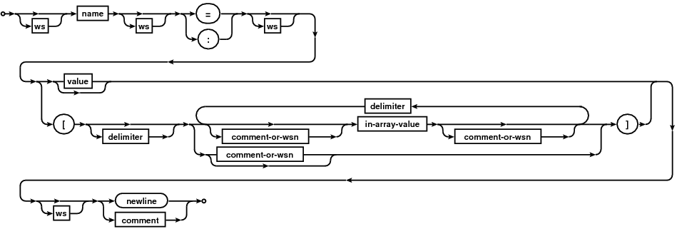
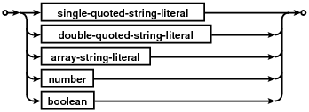
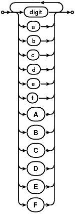
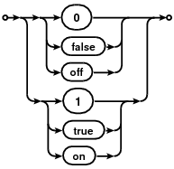
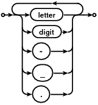

# Configuration file
## Redefinitions
If variable is declared more than once, the value from the last definition will be used.

## Example
```sh
# Server address
address: 127.7.7.7:8080

# Number of server workers (cannot be lower than 1)
workers: 2
# Number of connections (cannot be lower than 1)
connections= 100 # '=' may also be used as an assignment operator

# In case of normal variables (not arrays) value may be omitted
empty-var.try_it: # dash, dot and underscore are allowed in variable name


#Comments without trailing white-space also works
foo=bar#Comments may appear on the end of the variable (also in arrays)

# Values may be also single-quoted strings
a1 = ' test test '
# in which an apostrophe may be escaped with sequence '' for example:
a2 = 'This''s awesome'

# Double quoted strings also may be used
b1 = "\n\n'Foo bar'\n\ttest\n # This is not a comment" # But this IS a comment

test1 = [an, inline, array]
test2 = [
  # In arrays empty (not containing a value) lines are ignored
  '1',
  2,
  3 # Instead of a comma newline may also be used as a delimiter
    # But be careful, because many newlines and commas (delimiters) between two
    # values are treated as one. At the beginning and the ending of an array
    # delimiters are also ignored.
  4, 5

  "6", '7', 8
]

test3 = [,,1,2,,3,
  4
  ,5
  ,
]
# test3 and test4 are equivalent
test4 = [1, 2, 3, 4, 5]

test5 = [1, 2
  3
  4
  5 6 7 # This is equivalent to '5 6 7'
]

```
The above config is totally equivalent to this:
```sh
a1: " test test "
a2: "This's awesome"
address: "127.7.7.7:8080"
b1: "\n\n'Foo bar'\n\ttest\n # This is not a comment"
connections: "100"
empty-var.try_it: ""
foo: "bar"
test1: [
  "an"
  "inline"
  "array"
]
test2: [
  "1"
  "2"
  "3"
  "4"
  "5"
  "6"
  "7"
  "8"
]
test3: [
  "1"
  "2"
  "3"
  "4"
  "5"
]
test4: [
  "1"
  "2"
  "3"
  "4"
  "5"
]
test5: [
  "1"
  "2"
  "3"
  "4"
  "5 6 7"
]
workers: "2"
```

## Syntax
##### config-file:

##### directive:

##### directive-formal:

##### delimiter:

##### comment:

##### comment-or-wsn:

##### value:

##### in-array-value:

##### string-literal:

##### array-string-literal:

##### single-quoted-string-literal:

##### double-quoted-string-literal:

##### hex-digit:

##### number:

##### boolean:

##### name:

##### ws:

##### wsn:

